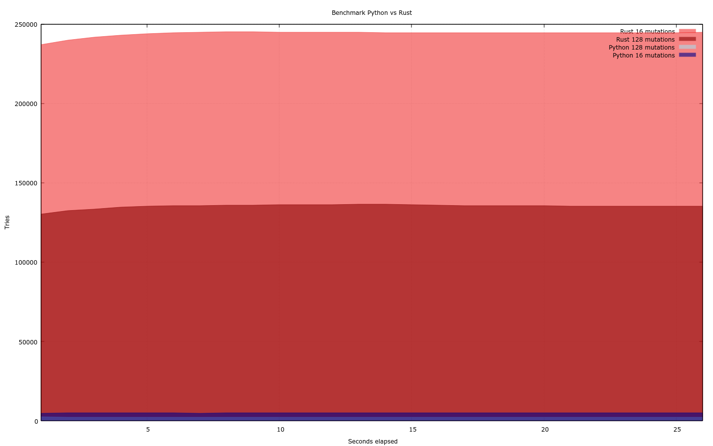

# Notes

- It may take a while to reach the target score, but it would eventually.
- Using a larger corpus may avoid situations where the solution is very hard to find and no progress is made. Every entry in the corpus stays independant, so reaching the solution is slower, but more probable.

# Benchmark

In order to get faster result, I implemented the solution in Rust as well.

Here is a benchmark of the perfs:

In the best case, the Rust version solved the challenge in 103ms. ¯\\\_(ツ)_/¯  
Had luck on my side.

# Flag

`DGA{Bri@nIsInThe_Kitchen}`

# Note

In the Rust version, the generated file `solution.json` needs to be updated
to be compliant with the expected format.
